```{r setup, include = FALSE}
options(htmltools.dir.version = FALSE)
library(knitr)
library(tidyverse)
library(xaringanExtra)

# set default options
opts_chunk$set(echo=FALSE,
               collapse = TRUE,
               fig.width = 7.252,
               fig.height = 4,
               dpi = 300)
xaringanExtra::use_tile_view()
xaringanExtra::use_tachyons()
xaringanExtra::use_scribble(pen_size = 2)
xaringanExtra::use_clipboard()
xaringanExtra::use_broadcast()
xaringanExtra::use_share_again()
xaringanExtra::style_share_again(
  share_buttons = c("twitter", "linkedin", "pocket")
)

```

class: title-slide, center, middle
background-image: url(img/frame.jpg)
background-size: cover

.right-column[
# `r rmarkdown::metadata$title`
### `r rmarkdown::metadata$subtitle`

**`r rmarkdown::metadata$author`**<br>
`r rmarkdown::metadata$date`
]

.palegrey[.right[.footnote[Graphic by [Katie](https://www.rawpixel.com/image/2357171/free-illustration-image-abstract-background-color)]]]

---
# En la clase de hoy:

- Concepto de inferencia. Población y muestra. 

- Parámetros y estimadores

- Distribuciones Muestrales

- Intervalos de confianza para la media con varianza conocida

- Ejercitación

--

### .orange[**Recreo**] `r emo::ji("coffee")`🧉

--

- Distribución t-student

- Intervalos de confianza para la media con varianza desconocida

- Ejercitación

---

#Estadística Inferencial

.bg-washed-light-purple.b--orange.ba.bw2.br3.shadow-2.ph4.mt5[
Permite estimar parámetros poblacionales

Probar hipótesis formuladas por sobre una población

Construir modelos estadísticos y efectuar predicciones

]
---
# Recordar:

**Población**: es el conjunto de todos los individuos de interés. Normalmente es demasiado grande para poder abarcarla toda = censo

--

**Muestra**: es un subconjunto representativo de la población y es sobre el que realmente hacemos las observaciones

--

**Variable**: es la característica de interés que es medida en cada uno de los individuos

--

**Observación o dato**: es el valor particular que toma la variable en cada individuo

--

**Unidad Experimental**: es la menor unidad de la cual se obtiene una observación independiente

---
class: center, middle
###La inferencia estadística consiste en generalizar las conclusiones extraídas de una muestra sobra una población

.center[
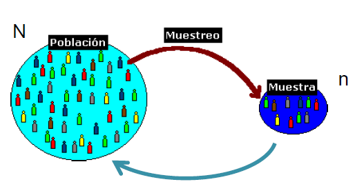
]
---

## Distribución de Probabilidades

**.orange[Función de densidad f(x)]** es una función que describe la distribución de probabilidades de la variable aleatoria continua x.


.center[
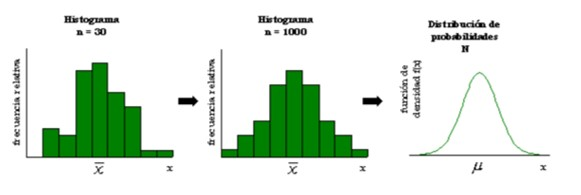
]

---
# Distribución Normal

.center[
$X \sim {\sf N}(\mu, \sigma^2)$
]

```{r, fig.height = 2, fig.width=4}
library(ggplot2)
p9 <- ggplot(data.frame(x = c(-4, 4)), aes(x=x)) +
        stat_function(fun = dnorm)
p9+ theme_bw()
```

- Media, mediana y moda coinciden.

- Dominio de la variable -∞< x < ∞

---
#Estandarización

`r emo::ji("heavy_check_mark")` La variable de estudio es tranformada (reescalada) en una variable normal estándar.

.center[

$\LARGE z= \frac{x- \mu}{\sigma}$

`r emo::ji("heavy_check_mark")` Cuanto mas grande sea el valor de Z, mas lejos estará el valor de la media.

]
---
# Parámetro y Estimador

**.purple[Parámetro]**: se calculan sobre los N valores de la población, por lo tanto no cambian a menos que cambie la población, son constantes

**.purple[Estimador]**: se calculan sobra n valores muestrales, por lo tanto varían de muestra en muestra y por lo tanto son variables aleatorias.

.center[

]
---
# Supongamos...

.center[
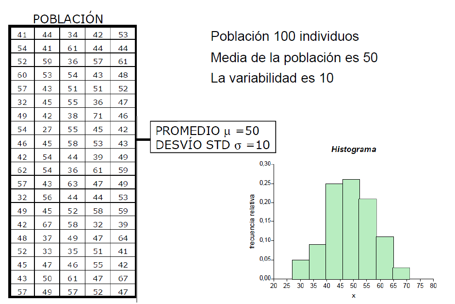
]
---
## Y si se repite el procedimiento muchas veces?

.center[
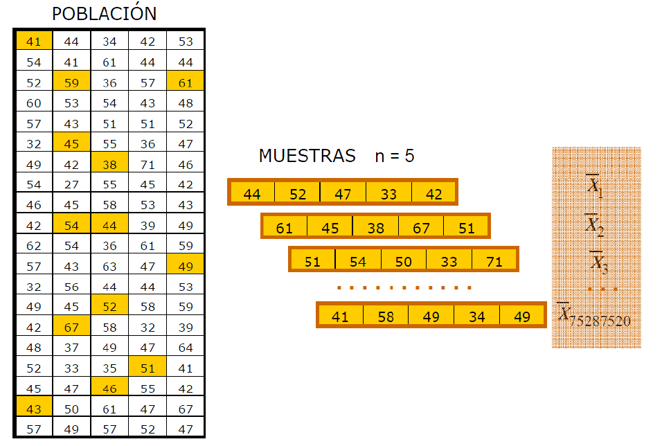
]
---
## Distribución muestral de $\overline{x}$

.center[
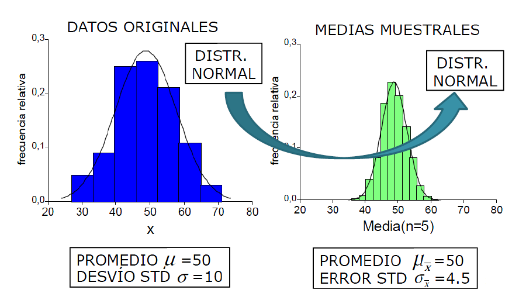
]

--
.center[

$\LARGE \mu_{\overline{x}}= \mu$

$\LARGE \sigma_{\overline{x}}= \frac{\sigma}{\sqrt{n}}$
]
---
# Distribución muestral

.bg-washed-light-purple.b--orange.ba.bw2.br3.shadow-2.ph4.mt5[
La distribución muestral de un estimador es la distribución de probabilidades de todos los posibles valores de un estimador que se pueden obtener extrayendo infinitas muestras aleatorias de tamaño n de la población.
]

---
##Teorema central del límite

.bg-washed-light-purple.b--orange.ba.bw2.br3.shadow-2.ph4.mt2[
Si de una población con .orange[distribución no normal o desconocida] con media μ y desvío estándar σ se extraen infinitas muestras aleatorias de tamaño n y a cada una se ellas se le calcula el promedio X se demuestra que éste se comporta según una .orange[distribución normal si n es lo suficientemente grande.]
]

.center[
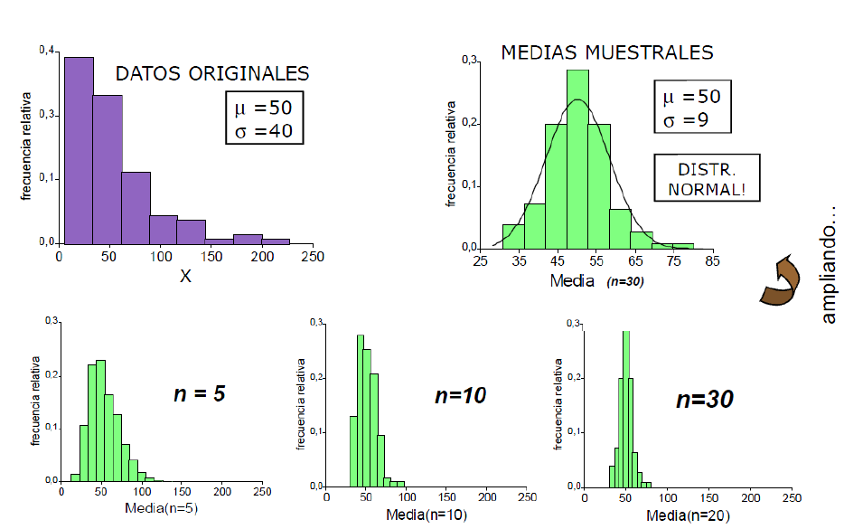
]
---
# Estimación puntual y por IC

**.purple[Estimación Puntual]**: se calcula un valor a partir de la muestra a fin de estimar el parámetro.

**.purple[Intervalo de Confianza]**: se calculan dos números para crear un rango de valores que se espera que contengan al parámetro con una cierta probabilidad o nivel de confianza.

--

.center[
$\LARGE P(LI< \theta < LS)= 1 - \alpha$
]

---
### Intervalo de confianza: Nivel de confianza

- Probabilidad de que el intervalo contenga al parámetro (1- $\alpha$)

--

- Se fija a priori (0.9, 0.95, 0.99)

--

- $\alpha$ es la probabilidad de error (NO contener al parámetro) y se la denomina riesgo

.center[
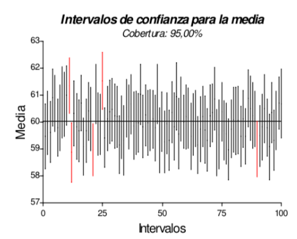
]

---
### IC para la media poblacional de una v.a. normal con varianza poblacional conocida

1- ¿Qué parámetro vamos a estimar? En este caso $\mu$

2- Estimador con distribución conocida

3- Definir un estadñistico de prueba con distribución conocida

.center[
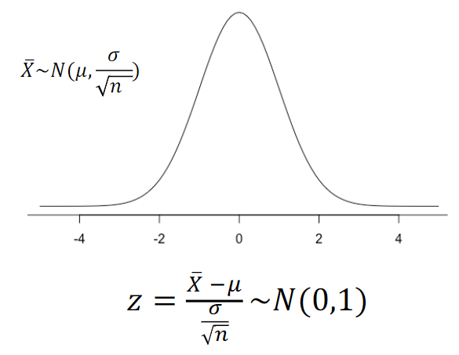
]
---
### IC para la media poblacional de una v.a. normal con varianza poblacional conocida

.center[
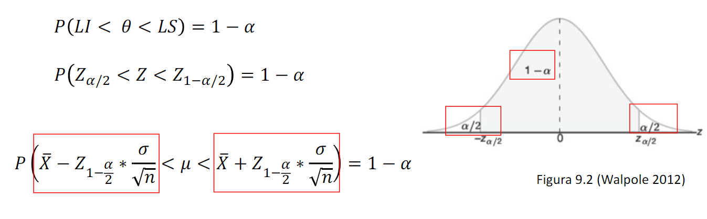
]

.center[
$\LARGE\overline{x} \pm Z_{1-\frac{\alpha}{2}}* \frac{\sigma}{\sqrt{n}}$
]

---
#Ejercitación

Ejercicio 1- La Cámara de Comercio desea tener una estimación del valor medio del alquiler de un
departamento de un ambiente. Una muestra aleatoria de 40 departamentos de estas características arrojó como resultado una media mensual de los alquileres (de esta muestra) es de
$323. Se conoce en el mercado que la desviación estándar de la variable “alquiler mensual de un
depto. de 1 amb” es $25.

a) Determine un intervalo de confianza de 99% para la media del alquiler de la población total de departamentos de un ambiente.

¿cuál es la variable x?¿Distribución?
---

---
#Ejercitacion

Ejercicio 2- La Asociación de Empresarios Gastronómicos reunió información sobre la cantidad de veces que los
matrimonios jóvenes comen fuera de casa a la semana. Una encuesta de 60 parejas indicó que la cantidad
media de veces que fuera de casa por semana fue 2.76 comidas semanales. Mediante estudios previos se
pude afirmar que la desviación standard poblacional de la variable “cant de veces por semana que las
parejas jóvenes comen afuera” es de 0.75. Construya el intervalo de confianza de 90 % de la media
poblacional.

---
### IC para la media poblacional de una v.a. normal con varianza poblacional desconocida

En la práctica es habitual que TODOS los parametros poblacionales son desconocidos, es decir que ni el promedio μ ni el desvío estándar σ son conocidos.

--

Se demuestra que la media muestral en estos casos ajusta a una distribución conocida como **.orange[t de Student]**

.center[
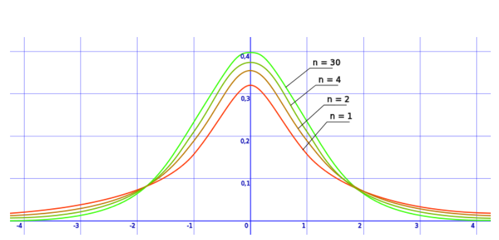
]

---
# Distribución de t-student

.center[

]

Los **.orange[GL indican la cantidad de datos independientes]**, es decir el numero de observaciones de la varibal menos el número de restricciones que verifican

A medida que aumentan los GL mas se asemejan a la normal estándar (porque s converge a σ )
---
### IC para la media poblacional de una v.a. normal con varianza poblacional desconocida

.center[
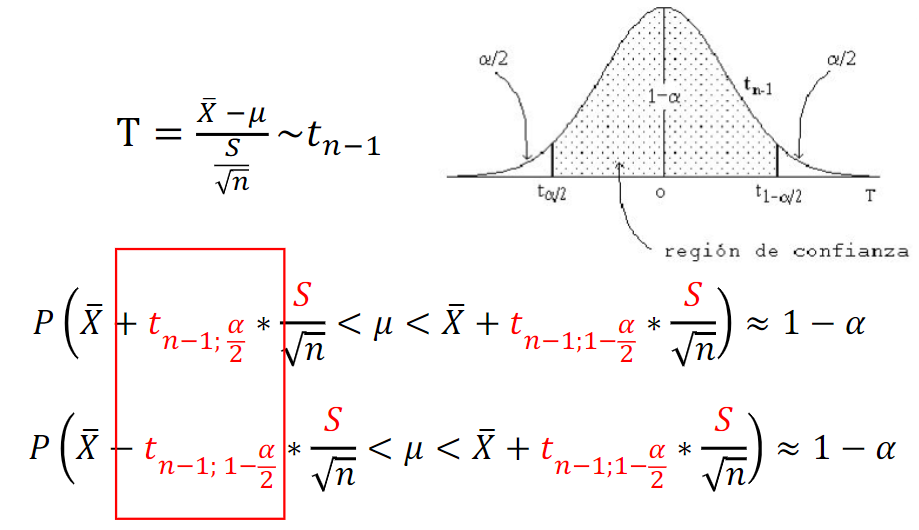
]
---

### IC para la media poblacional de una v.a. normal con varianza poblacional desconocida

.center[

$\LARGE P(LI< \theta < LS)= 1 - \alpha$

$\LARGE \overline{x} \pm t_{(n-1; 1-\frac{\alpha}{2})} * \frac{\ s}{\sqrt{n}}$
]

---
# Ejercitación

Las ventas de una revista semanal han sido las siguientes (en miles) en las últimas cuatro semanas: 15,4 -18,5 - 16,3 - 19,2.

a) Estimar la venta media semanal con un 95% de con