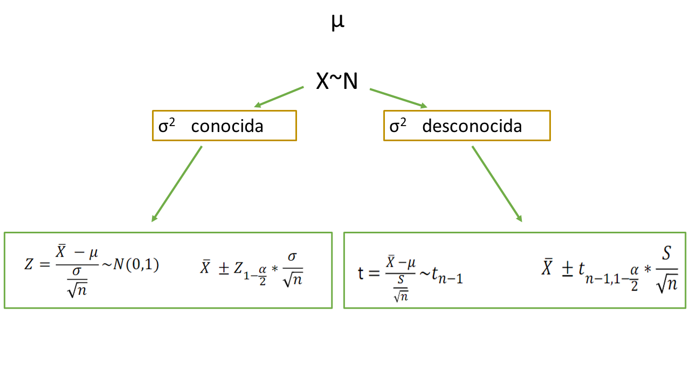
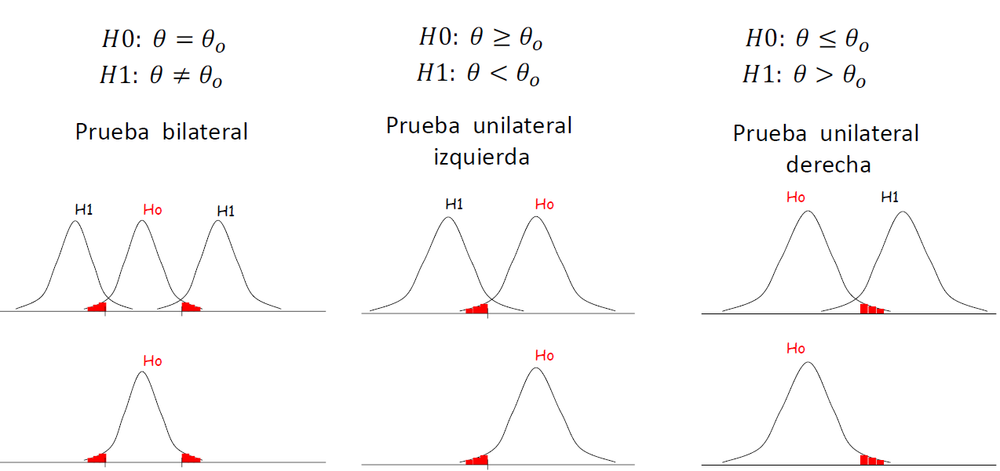
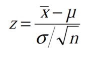
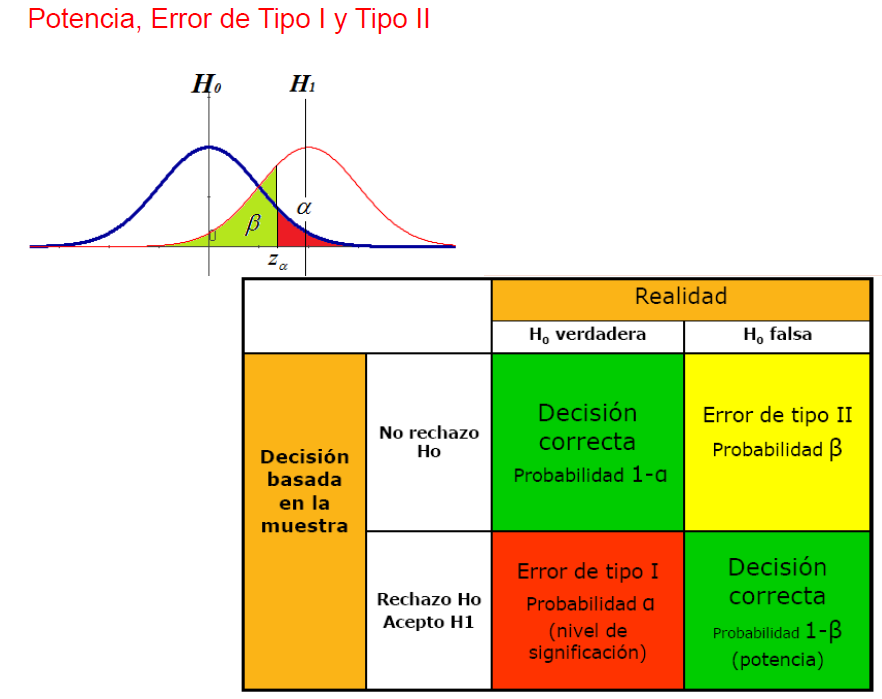
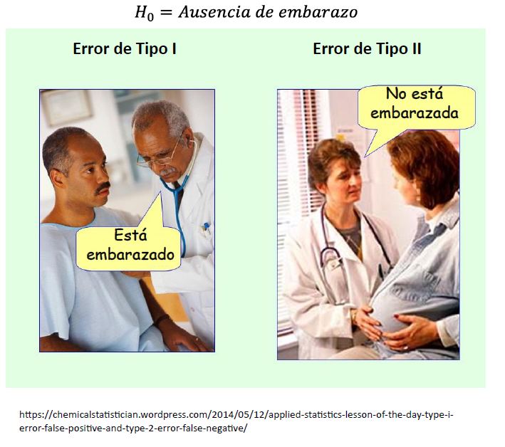

```{r setup, include = FALSE}
options(htmltools.dir.version = FALSE)
library(knitr)
library(tidyverse)
library(xaringanExtra)

# set default options
opts_chunk$set(echo=FALSE,
               collapse = TRUE,
               fig.width = 7.252,
               fig.height = 4,
               dpi = 300)
xaringanExtra::use_tile_view()
xaringanExtra::use_editable()
xaringanExtra::use_tachyons()
xaringanExtra::use_scribble(pen_size = 2)
xaringanExtra::use_clipboard()
xaringanExtra::use_broadcast()
xaringanExtra::use_share_again()
xaringanExtra::style_share_again(
  share_buttons = c("twitter", "linkedin", "pocket")
)

```

class: title-slide, center, middle
background-image: url(img/frame.jpg)
background-size: cover

.right-column[
# `r rmarkdown::metadata$title`
### `r rmarkdown::metadata$subtitle`

**`r rmarkdown::metadata$author`**<br>
`r rmarkdown::metadata$date`
]

.palegrey[.right[.footnote[Graphic by [Katie](https://www.rawpixel.com/image/2357171/free-illustration-image-abstract-background-color)]]]

---
# En la clase de hoy:

- Prueba de Hipótesis para una muestra 

- Ejemplos

--

### .orange[**Recreo**] `r emo::ji("coffee")`🧉

--

- Ejercitación

---

#En la clase anterior...

.bg-washed-light-purple.b--orange.ba.bw2.br3.shadow-2.ph4.mt5[

**Estadística Inferencial**

Permite estimar parámetros poblacionales

Probar hipótesis formuladas por sobre una población

Construir modelos estadísticos y efectuar predicciones

]
---
## Intervalo de confianza para la media poblacional

.center[

]
---
# ¿Qué es una prueba de hipótesis?

- Es un proceso para determinar la validez de una aseveración hecha sobre la población basándose en evidencia muestral

- Es una afirmación sobre la población, a nivel de sus parámetros


- Debe plantearse antes de obtener la muestra

.bg-washed-light-purple.b--orange.ba.bw2.br3.shadow-2.ph4.mt5[
La prueba de hipótesis es un procedimiento de toma de decisión , relacionada principalmente con la elección entre dos conjuntos posibles de valores del parámetro
]

---
#Definiciones importantes

.center[
Hipótesis de investigación **.orange[no es lo mismo que]** la hipótesis estadísticas
]

**.purple[Hipótesis de investigación]**: denotada por Hi expresa el objetivo de la investigación

**.purple[Hipótesis estadística]**

- .purple[La hipótesis nula] , denotada por Ho, es el status quo o estado actual (lo que se cree hasta el momento) o la que asegura que no hay
diferencias en la población. Es la hipótesis del no efecto

- .purple[La hipótesis alternativa], denotada por H1 o Ha, es lo opuesto a la hipótesis nula, el cambio en la población que el investigador/a espera sea verdadero

---

# Definamos las hipótesis: Ejemplo 1

Supongamos que se quiere determinar la efectividad de incorporar la vitamina E a la dieta de cerdos a fin de mejorar el aumento de peso, que actualmente es de 100g/día.

--

### Definir la Variable de estudio


**X**.can-edit.key-mu[= ?]

--

### Planteo de las hipótesis 

.center[

Ho .can-edit.key-hipnula[ ? ]

Ha .can-edit.key-hipAlt[  ? ]

]

---

# Ejemplo 2

La concentración de almidón en plantas de lechuga en la provincia de Buenos Aires, sigue una distribución normal con media 28 g y varianza 25 (μ g)2.
Se quiere poner a prueba la hipótesis de que la concentración media de almidón disminuye con un tratamiento de abono.

### Definir la Variable de estudio


**X**.can-edit.key-mu[= ?]

--

### Planteo de las hipótesis 

.center[

Ho .can-edit.key-hipnula[ ? ]

Ha .can-edit.key-hipAlt[  ? ]

]
---
# Ejemplo 3

Se quiere conocer el el ajuste de un torno mecánico. SI esta bien ajustado , la media es de 2 cm., pero cuando la herramienta de corte adopta una posición incorrecta, dicho promedio se altera, aumentando o disminuyendo, sin llegar a modificarse el desvio estándar.

### Definir la Variable de estudio


**X**.can-edit.key-mu[= ?]

--

### Planteo de las hipótesis 

.center[

Ho .can-edit.key-hipnula[ ? ]

Ha .can-edit.key-hipAlt[  ? ]

]
---
# Planteo de hipótesis

.center[

]

---

# Pasos a seguir para plantear una PH

1- Plantear las hipótesis estadísticas.

2- Seleccionar un esPmador del parámetro y el estadísPco de prueba (con distribución conocida).

3- Fijar el nivel de significación de la prueba.

4- Establecer la condición de rechazo (CR) y regla de decisión (RD).
- CR: bajo que probabilidades o valores del estadístico de prueba se debería rechazar Ho.

- RD: explicar en términos del problema como se procede.

5- Contrastar la muestra con la distribución teórica, calcular el p-valor y concluir.

---

# Ejemplo


La duración media de una muestra de 100 tubos fluorescentes producidos por una
compañía con un nuevo protocolo resulta ser de 1570 horas. Si la duración media de
todos los tubos producidos por la compañía es 1600 horas con un desvío estándar de 120 horas, comprobar si la duración media ha cambiado con el nuevo protocolo.Asumir que duración en horas de los tubos es una variable con distribución normal.

### Planteo de las hipótesis


---
### 2) Seleccionar un estimador del parámetro y el estadístico de prueba (con distribución conocida).

--
.center[

]

--

### 3) Fijar el nivel de significación de la prueba.


---
### 4) Establecer la región crítica y la regla de decisión.

---

# Obteniendo los valores críticos

Como estamos trabajando en Ho, trabajamos en la distribución Z.

```{r, echo=TRUE}
 qnorm(p=0.05/2)# Prueba Bilateral

```

Si tuviesemos una Prueba unilateral:

```{r, echo=TRUE}

qnorm(p=0.05, lower.tail = TRUE)#PU derecha

qnorm(p=0.05, lower.tail = FALSE)#PU Izquierda
```
---
### 5)Contrastar la muestra con la distribución teórica, tomar una decisión, calcular el p-valor y concluir.

---

# El P-valor

.bg-washed-light-purple.b--orange.ba.bw2.br3.shadow-2.ph4.mt5[

**.purple[p-valor]** se define como la probabilidad de que un valor estadísPco calculado sea posible dada una
hipótesis nula cierta.

Si cumple con la condición de ser menor al nivel de significancia impuesto arbitrariamente,
entonces la hipótesis nula será, eventualmente, rechazada.
]

Graficamente???

---
# Concluyendo

Si se rechaza Ho:

- La evidencia muestral contradice Ho

- Hay pruebas concluyentes contra Ho

- La prueba es significativa

--

Si **no** se rechaza Ho:

La evidencia muestral no contradice Ho

- No hay evidencias contra Ho

- La prueba no es concluyente

---

## Riesgos al tomar una decisión

.center[

]

---
## Riesgos al tomar una decisión

.center[

]

---
# Definiciones

$\alpha$ = P(error tipo I) = P(rechazar Ho / Ho es verdadera)

$\beta$= P(error tipo II)= P(no rechazar Ho / Ho es falsa)

$1-\beta$ = Potencia = P(rechazar Ho / Ho es falsa) ó Poder o capacidad de la prueba estadística para detectar diferencias cuando estas realmente existen

---
#Problema 1

Un cliente recibe habitualmente una partida de medidores eléctricos que, según las especificaciones del contrato, el promedio de las pérdidas debe ser menor o igual a 1 watt. Una muestra de 10 medidores, de una partida recién recibida, arroja una pérdida media de 1,06watts. Se sabe además, por experiencia anterior, que las pérdidas se distribuyen Normalmente con un desvío de 0,1watts.

a) Asumiendo en un 10% la probabilidad de rechazarla indebidamente, ¿puede aceptarse la misma?

---
# Problema 2

El espesor óptimo para obleas de silicio utilizadas en cierto tipo de circuito integrado debe ser superior a 245 nm. Un fabricante de productos electrónicos revisa todas las entregas eligiendo una muestra de 50 obleas del lote y estimando su espesor promedio. En la última entrega obtuvo una media de espesor de 246.18 nm y una desviación estándar de 3.6 nm.

“Si el espesor medio del lote fuese 248nm, que probabilidad hay de que el fabricante acepte el lote”. ¿A qué probabilidad se refiere?

---

